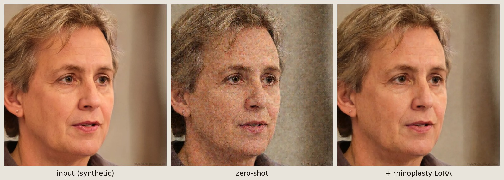
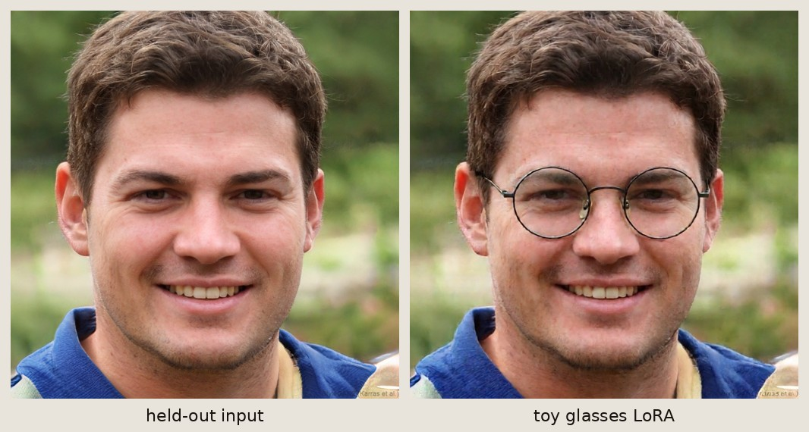

# Aura

AI-assisted plastic-surgery outcome visualization. Originally built for **Knight
Hacks VIII** (Oct 24–26, 2025). Now being rebuilt as a personal project by
**Munish** and **Logan**.

This README is an internal status doc for the two of us — context, current
state, and what's next. Updates appended at the bottom.

---

## Status (July 2026 — `fable` branch)

The hackathon code in this repo is **frozen**. The rebuilt ML pipeline lives
in **`ml/`** in this repo (the separate `aura-ml/` sibling-repo plan was
dropped; it's simpler as one repo). The hackathon stack — DreamOmni2 on
FLUX.1-Kontext, Qwen2.5-VL prompt expander, AMD MI300X / ROCm, iOS LiDAR app,
Express backend, React frontend — is gone end-to-end.

**Where we are right now**: the pipeline is implemented and running on the
5090 box. Editor is **Qwen-Image-Edit-2511** (newest open Qwen edit model,
NF4-quantized, ~17 GB), expander is **Qwen3.5-9B** (4-bit, ~7 GB) with a
tightened prompt contract (strict output structure, conservative-magnitude
enforcement, out-of-scope guard, deterministic sanitizer + rule-based
fallback). The eval harness with the static-image canary is wired end-to-end,
and `ml/src/aura_ml/training/train.py` is a full QLoRA flow-matching trainer
that mirrors the diffusers pipeline's conditioning exactly and auto-quarantines
checkpoints that trip the canary. See `ml/README.md` for the quickstart.

What's still open: procedure LoRAs need real paired data (HDA database or
curated synthetic pairs) — the training loop is validated on the toy task.

---

## Results

"shave the dorsal hump down" on a synthetic (StyleGAN) face — zero-shot
Qwen-Image-Edit-2511 vs the same edit with our rhinoplasty LoRA composed in.
The LoRA was trained on real before/after pairs and renders visibly cleaner
than the quantized base while keeping the edit conservative:



The toy task that validated the training loop — an "add glasses" LoRA applied
to a face it never saw during training (high-divergence on purpose, so
identity collapse fails loudly on the eval canary):



All faces here are StyleGAN-synthetic; the HDA imagery used for training and
eval is research-only and never committed.

## Background

### What Aura was

Aura is a tool that takes a face photo plus a natural-language instruction
("make the nose smaller and straighter") and generates a realistic preview of
what the post-surgery face would look like. The pitch: existing surgical
visualization software costs $50K–$200K, takes weeks to produce a single
preview, and looks artificial. We thought a generative AI pipeline could do it
in seconds for cents per inference.

### Why it existed

Three concrete problems we were aiming at:

1. **Cost** — current tools price most clinics out.
2. **Latency** — weeks-long turnaround on a 3D model breaks the consultation
   loop. A surgeon can't iterate with a patient in real time.
3. **Realism** — existing previews look obviously fake, which kills patient
   trust and makes the conversation harder.

The hackathon scope covered three procedures: **rhinoplasty** (nose),
**rhytidectomy** (facelift), **blepharoplasty** (eyelid).

### What was built (October 2025)

Four-person team over a weekend at Knight Hacks VIII (Munish Persaud, Logan
Flickinger, Md Sahif Hossain, Micah Patrick). Five components:

- **iOS app** (`app/`) — ARKit + Vision face detection, three RGB photo
  capture, continuous LiDAR depth scan, multipart upload. The depth data was
  uploaded but **never actually used** in training or inference (tech report
  §3.2 admits this).
- **Express backend** (`backend/`) — `/api/transcribe` (ElevenLabs STT via a
  spawned Python subprocess) and `/api/generate-images` (SSH into the AMD GPU
  box, drop a JSON job, run remote Python, SFTP results back).
- **React frontend** (`frontend/`) — three pages (homepage, prompt, about),
  voice recording via MediaRecorder, axios calls to backend.
- **ML pipeline (off-repo, on the AMD box)** — DreamOmni2 (FLUX.1-Kontext
  backbone) + Qwen2.5-VL prompt expander + three procedure LoRAs (rhinoplasty
  r=32, facelift r=64, blepharoplasty). Trained with PEFT + diffusers on AMD
  MI300X (192 GB HBM3) using ROCm. Hyperparams: AdamW lr=5e-4 cosine to 5e-6,
  100 epochs, MSE noise-prediction loss, bf16 AMP, gradient checkpointing,
  batch 4.
- **Dataset** — ~200 source/target image pairs per procedure with text
  instructions and VLM-generated detailed prompts. Synthetic. Tech report §8.2
  flagged it as the weakest part of the system.

Devpost: <https://devpost.com/software/aura-shaping-the-future-you>
Tech report: [`Aura_Tech_Report.pdf`](Aura_Tech_Report.pdf)

### Why it stalled

A few things piled up after the hackathon and we never got back to it cleanly:

1. **The trained LoRAs gave static images at inference.** Apply the LoRA to
   the base model, feed it a face photo + instruction, get back the input
   essentially unchanged. This is the failure mode that made the demo
   unshippable. Most likely root causes (ranked):

   - *Identity collapse during training.* The synthetic dataset had too many
     pairs where source ≈ target. The loss is minimized by the model learning
     "copy the input." LoRA encodes an identity transform.
   - *Conditioning images missing at inference.* Backend SSH'd to the GPU
     box, dropped a JSON job, then the Python script read conditioning images
     from `--input_dir`. The audit found that the iOS upload contract didn't
     match any backend route — so the conditioning images may have silently
     never been there at all, and the model degenerated to identity.
   - *LoRA scale too high* (mode collapse to a frozen prior on a low-rank
     adapter).
   - *Wrong target modules at load time* (training applied LoRA to attn +
     MLP per report §4.2; if the inference loader only patched attention, the
     LoRA was effectively missing most of its capacity).
   - *bf16 train → fp16 infer precision mismatch* underflowing the LoRA
     contribution.

   We are designing the new eval harness specifically to catch this failure
   mode early — see "Pipeline architecture" below.

2. **The AMD MI300X access went away.** The hackathon-provided ROCm cluster is
   no longer available, and porting back to NVIDIA is ~free anyway since we
   weren't doing anything ROCm-specific other than fighting it.

3. **The repo had structural issues** that made it painful to pick up:

   - `backend/server.js` references `${REMOTE_JSON_PATH}` (undefined; should
     be `${remoteJsonPath}`) — would crash. `debug-server.js` was the
     bug-fixed copy that actually ran the demo, and the two drifted.
   - `frontend/src/pages/prompt/prompt.tsx` has a duplicate
     `<option value="Blepharoplasty">` in the procedure dropdown.
   - Frontend hardcodes `http://localhost:5000`.
   - iOS app upload contract matches neither documented backend route. The
     iOS app was effectively standalone.
   - Root `package.json` only declares `react-router-dom` and is otherwise
     vestigial. `mongoose`, `multer`, `@elevenlabs/elevenlabs-js` declared in
     `backend/` and unused.
   - The iOS app was, frankly, kind of shitty. The LiDAR data path didn't
     contribute anything to the actual pipeline.

4. **Team shrunk from four to two.** Sahif and Micah moved on. The remaining
   scope needs to fit two people working on it in spare time.

---

## What's changed for the rebuild

| Layer | Hackathon (Oct 2025) | Rebuild (Jul 2026) |
|---|---|---|
| Diffusion model | DreamOmni2 (FLUX.1-Kontext, non-commercial license, paper-repo code) | **Qwen-Image-Edit-2511** (Apache 2.0; Dec 2025, newest open Qwen edit model — less drift, much better identity/character consistency than 2509) |
| Prompt expander | Qwen2.5-VL-7B | **Qwen3.5-9B** (Mar 2026; unified early-fusion VLM) + tightened contract: fixed region→change→preserve structure, banned-amplifier substitution, OUT_OF_SCOPE guard, template fallback |
| Training scaffold | Custom PyTorch on ROCm | Self-contained QLoRA trainer on `diffusers` + `peft` (`ml/src/aura_ml/training/train.py`), conditioning cached so the 7B text encoder never competes with training for VRAM |
| Hardware | AMD MI300X 192 GB / ROCm | RTX 5090 32 GB / CUDA 12.8 (Blackwell sm_120) — everything NF4/4-bit quantized to fit |
| Capture | iOS app + LiDAR + Express + React + Swift | **Plain photo upload** in a single Gradio file |
| Identity preservation | Not addressed (system "overshot" — report §7.2) | 2511's native consistency + preserve-clause enforced in every prompt + ArcFace floor in eval; identity LoRA composition supported at inference |
| Eval | Manual eyeballing | Holdout grid with ArcFace cosine, **edit-magnitude (static-image canary)**, LPIPS, CLIPScore; live metrics in the demo; canary auto-quarantine in training |

### Why Qwen and not FLUX

FLUX.1 Kontext is technically still strong but: (a) non-commercial research
license, (b) Qwen-Image-Edit-2509/2511 outperforms it in head-to-head edit
tests (community 25-prompt and 700-test benchmarks both rank Qwen first as of
Apr 2026), (c) Qwen ships native paired-data training conventions in
`ai-toolkit` (`control / target / test` folder layout), (d) Apache 2.0 means
weights are freely distributable if we ever want to share anything. We
considered FLUX.2 [dev] but it's 32B and really wants 80 GB VRAM — overkill on
a 5090.

Re-checked July 2026: **2511 over 2509** — same `QwenImageEditPlusPipeline`,
same Apache 2.0, but materially better character consistency (the metric this
project is graded on) and less image drift. Qwen-Image-2.0 (Feb 2026) would be
tempting — 7B, unified gen+edit, native 2K — but it's Qwen-Chat-only with no
open weights, so it's out. Training and serving both happen on 2511 so the
adapter/base always match (pre-mortem #4/#5).

### Why Qwen3.5-9B for the prompt expander

The prompt expander sits between the user and the diffusion model. Raw user
text ("make the nose smaller") is too vague for a diffusion model to act on
consistently. The expander sees the face photo + the user instruction and
emits a detailed, anatomically-grounded prompt the diffusion model can use.

Qwen3.5-9B (released March 2, 2026) is a unified vision-language foundation
that beats the older Qwen2.5-VL-7B and Qwen3-VL on visual reasoning. Same
~6.5 GB footprint in 4-bit. Drop-in upgrade.

---

## Pipeline architecture (target)

```
                    ┌─────────────────────────────────┐
                    │   Gradio demo UI (Python)       │
                    │   image upload + instruction    │
                    └──────────────┬──────────────────┘
                                   │
                                   ▼
                    ┌─────────────────────────────────┐
                    │   Qwen3.5-9B (4-bit, separate   │
                    │   process)                      │
                    │   in : photo + raw instruction  │
                    │   out: detailed diffusion prompt│
                    └──────────────┬──────────────────┘
                                   │
                                   ▼
        ┌─────────────────────────────────────────────────┐
        │   Qwen-Image-Edit-2509 (NF4 quantized)          │
        │   + procedure LoRA (rhino / facelift / eyelid)  │
        │   + identity LoRA (per-subject likeness)        │
        │   composed via pipe.set_adapters()              │
        └──────────────────────┬──────────────────────────┘
                               │
                               ▼
                    ┌─────────────────────────┐
                    │   edited face image     │
                    └─────────────────────────┘
```

Hardware budget on the 5090: NF4 base ~10–12 GB, cached text embeds (offload
text encoder after encoding) saves ~5–6 GB, checkpointed activations at
512–768px ~6–8 GB, AdamW-8bit optimizer state ~1–2 GB. ~4–6 GB headroom.
Training stays at 512–768px batch 1 + accumulation 4–8.

---

## Workstream plan

| # | Workstream | Status | Est. |
|---|---|---|---|
| 0 | Repo init, env, model downloads | **Done** | ½ wk |
| 1 | Zero-shot Qwen-Image-Edit-2511 inference baseline | **Done** (`ml/src/aura_ml/inference/qwen_edit.py`, NF4 on the 5090) | 1 wk |
| 2 | Eval harness with **static-image canary** | **Done** (`ml/src/aura_ml/eval/`, smoke-tested both directions) | 1 wk |
| 3 | Qwen3.5-9B prompt-expander module | **Done** (`ml/src/aura_ml/prompt_expander/qwen35.py` — tightened contract + guardrails + stdio service) | ½ wk |
| 4 | `train.py` against `diffusers` (toy task: "add glasses") | **Done** (full QLoRA flow-matching trainer w/ conditioning cache + canary quarantine) | 1 wk |
| 5 | Migrate to `ai-toolkit` | Dropped — own trainer mirrors the pipeline exactly and stays debuggable; revisit only if we need its recipes | ½ wk |
| 6 | Real LoRA training — rhinoplasty first | **Blocked on paired data** (loop validated on toy task; synthetic-pair curation implemented in `data/synthetic_pairs.py`) | 1–2 wk |
| 7 | Identity-preservation LoRA + composition | Composition path done (`set_adapters` w/ sidecar assert); per-subject training pending | ½ wk |
| 8 | Other two procedures (facelift, eyelid) | Configs ready; blocked on 6 | ½ wk |
| 9 | Gradio demo UI | **Done** (`ml/app/demo.py` — editable expanded prompt, live metrics + canary badge) | ½ wk |

"Wk" = a weekend's worth of focused work, not calendar weeks. Realistic total:
3–6 months at our pace.

### Critical mitigation: the static-image canary

Workstream 2 is the highest-leverage thing we will build. Every trained
checkpoint runs against a holdout set of 100 (face, instruction) pairs. We
compute four metrics:

- **Edit magnitude** = `1 − cosine(DINO(source), DINO(output))`. Near-zero
  means the model copied the input — exactly the failure mode that killed the
  hackathon LoRAs. Auto-flagged.
- **ArcFace cosine** between source and output. High = identity preserved.
- **LPIPS** between source and output. Sanity check.
- **CLIPScore** between instruction text and output. High = followed the
  instruction.

We want: edit magnitude > ~0.05, ArcFace ≥ 0.6, CLIPScore improving over the
zero-shot baseline. The toy task in workstream 4 ("add glasses") forces
visible source/target divergence so identity collapse fails loudly on the
first training run.

---

## Dataset state

We have the original facial photos organized in folders by surgery type. Per
the plan, dataset work is **deferred** — we focus on the pipeline first.
Realities to plan around:

- The folders are very likely **unpaired** (random post-op photos, not
  matched before/after). Instruction-tuned Qwen-Image-Edit LoRAs need
  `(control, target, instruction)` triples.
- Workstreams 0–5 require zero paired data. We'll hand-curate ~20 pairs for
  the toy task.
- Pairing becomes blocking at workstream 6. Three escape routes:
  1. DreamBooth-style identity LoRA (no pairs needed; useless for the actual
     procedure goal but exercises the loop).
  2. Synthetic pairing via zero-shot Qwen-Image-Edit + Qwen3.5-9B critique.
     This is the same pattern that produced the bad hackathon dataset, so we
     curate aggressively with the eval harness.
  3. Hand-curate ~20 pairs from public before/after sources.

---

## Repo state

```
AURA/                            ← this repo
├── app/                         iOS app (Swift, ARKit, LiDAR) — FROZEN hackathon code
├── backend/                     Express + node-ssh — FROZEN hackathon code
├── frontend/                    React + Vite — FROZEN hackathon code
├── Aura_Tech_Report.pdf         the 17-page hackathon writeup; useful background
├── package.json                 vestigial
├── README.md                    this file
└── ml/                          ← ACTIVE — the rebuilt pipeline (see ml/README.md)
    ├── pyproject.toml           uv-managed, torch from cu128 index, Python 3.12
    ├── scripts/                 verify_env, download_models (2511 + Qwen3.5-9B ~62 GB),
    │                            fetch_test_faces, build_eval_holdout, eval_smoke
    ├── src/aura_ml/
    │   ├── inference/           qwen_edit.py (NF4 wrapper + LoRA mgmt), pipeline.py
    │   ├── prompt_expander/     qwen35.py (tightened expander + stdio service)
    │   ├── training/            train.py (QLoRA flow-matching + canary quarantine)
    │   ├── data/                pair_loader.py, synthetic_pairs.py, SCHEMA.md
    │   └── eval/                metrics.py + grid.py (canary lives here)
    ├── configs/                 per-procedure training YAMLs
    ├── data/instructions/       instruction variants for synthetic pairing
    └── app/                     demo.py (Gradio)
```

The old plan had this as a separate `aura-ml` repo; keeping it as `ml/` in
this repo turned out simpler — the frozen hackathon dirs don't get in the way.
A web frontend can return later as a FastAPI module importing the same
inference code.

---

## Updates log

> Append little updates here so the other person can catch up quickly. Date,
> initials, what changed.

- **2026-04-17 (Munish)** — Audited the hackathon repo. Wrote the rebuild
  plan. Set up `aura-ml/` skeleton: `pyproject.toml` (cu128 wheel index for
  Blackwell), `verify_env.py`, `download_models.sh`, `.gitignore`, empty
  package layout. Plan file at `~/.claude/plans/eventual-juggling-stonebraker.md`.
  Next: actually run `verify_env.py` on the 5090, pull the models, write
  workstream 1.

- **2026-07-10 (Munish, `fable` branch)** — Finished the
  pipeline, verified end-to-end on the 5090.

  *Models*: editor bumped 2509 → **Qwen-Image-Edit-2511** (better identity
  consistency; same pipeline class), expander implemented on **Qwen3.5-9B**
  4-bit with a tightened contract (fixed region→change→preserve output
  structure, conservative-quantifier enforcement, OUT_OF_SCOPE guard,
  sanitizer, rule-based fallback, stdio service mode). Serving recipe locked
  after measurement: selective NF4 (first/last blocks bf16) + **Lightning
  8-step LoRA** — ArcFace 0.55 → 0.69 at 10× speed vs the 40-step recipe;
  torchao FP8 evaluated and rejected (float8dq OOMs; float8wo silently
  returned the input — caught by the canary, fittingly).

  *Code*: rewrote `inference/qwen_edit.py` for quantized loading (the old
  code put 40 GB bf16 on a 32 GB card), fixed the `pipeline.py` config-drift
  crash, implemented `pair_loader`, `synthetic_pairs` (two-phase curation:
  metric floors then VLM judge, editor and critic never share the GPU), and
  a full QLoRA flow-matching `train.py` that mirrors
  `QwenImageEditPlusPipeline` conditioning exactly (packed latents,
  sequence-concat control, template-64 prompt embeds, dynamic-shift sigmas,
  norm-preserving CFG in eval) with conditioning caching and canary
  auto-quarantine. Old configs' FLUX-style `target_modules` (`ff.net.*`)
  matched nothing on the Qwen transformer — replaced with the real module
  names. Rebuilt the Gradio demo on the package (editable expanded prompt,
  live metrics + canary badge, `--host` for phone uploads) and added a
  proper REST API (`aura_ml.server`): expand / generate (sync + async jobs)
  / metrics / health, one GPU worker + shared lock, OpenAPI docs at `/docs`.

  *Verified*: expander smoke (aggressive language toned down, identity-change
  request → OUT_OF_SCOPE, 2.5 s/call at 7.3 GB); eval smoke both directions
  (identity fixture trips canary at 100%, edited fixture 0%); zero-shot
  baseline through the API (21.5 s total for expand + edit + metrics,
  ArcFace 0.69, canary quiet); **toy "add glasses" training run**: 12
  synthetic faces → 8 curated pairs (VLM critic 0.90–1.00) → QLoRA r=16
  (106 M params) → epoch-5 eval on held-out faces: glasses visibly present,
  static=0%, ArcFace 0.67, checkpoint auto-promoted to best/. The
  identity-collapse failure that killed the hackathon is demonstrably absent
  from this loop.

  *Repo hygiene*: `ml/` folded into this repo, Windows-mangled UTF-16
  `requirements.txt` dropped (uv.lock is the source of truth), redundant
  `app/qwen_edit.py` shim deleted.

  *HDA arrived same day* (research-only license; results must cite Rathgeb
  et al., CVPRW 2020; imagery gitignored everywhere): built the real
  100-entry eval holdout (40 rhino / 30 facelift / 30 eyelid, with
  ground-truth "after" references), then 134 real rhinoplasty training
  triples with **per-pair instructions written by Qwen3.5-9B** looking at
  each before/after (all 134 passed the sanitizer; holdout stems excluded
  from training — no leakage).

  *First real rhinoplasty LoRA* (rank 32, 512 px, 30 epochs on the 134
  pairs): the run hugged the under-editing boundary the whole way — the
  canary tripped at epochs 9, 12 and 21 (62% of holdout outputs under the
  0.05 floor) and those checkpoints were auto-quarantined; late in the run
  it settled at 25–38% static with ArcFace ~0.79. Best checkpoint (epoch 15)
  makes visibly real but conservative nose edits on holdout faces and
  renders noticeably cleaner than zero-shot. Calibration on the holdout
  itself says the floor is fair: real before→after surgery pairs measure
  median 0.131 edit magnitude, only 3/40 below 0.05. Run #2 levers: drop
  the lowest-edit-magnitude training quartile, region-weighted loss around
  the nose. Remaining: facelift + eyelid LoRAs (same command, different
  `--procedure`), per-subject identity LoRA.

---

## Reference material

- Tech report: [`Aura_Tech_Report.pdf`](Aura_Tech_Report.pdf) — full writeup
  of the hackathon stack, training methodology, AMD-specific bits, and the
  retrospective in §8 (data quality, model capacity, time management). Worth
  re-reading before resuming.
- **HDA Facial Plastic Surgery Database** — real before/after pairs used for
  the eval holdout and procedure-LoRA training. Research use only, no
  commercial use or redistribution; the imagery must never be committed to
  this repo (gitignored), and LoRA weights trained on it stay private. All
  reported results must cite: C. Rathgeb, D. Dogan, F. Stockhardt,
  M. De Marsico, C. Busch, "Plastic Surgery: An Obstacle for Deep Face
  Recognition?", 15th IEEE CVPR Workshop on Biometrics (CVPRW),
  pp. 3510–3517, 2020.
- Devpost: <https://devpost.com/software/aura-shaping-the-future-you>
- Knight Hacks VIII: <https://knighthacksviii.devpost.com/>
- DreamOmni2 paper: <https://arxiv.org/html/2510.06679v1> (now superseded for
  our purposes)
- Schulman / Thinking Machines, "LoRA Without Regret" — the "two-bit rule"
  that drove the rank decisions in the original training, still relevant for
  the rebuild

## Active team

- **Munish Persaud** — pipeline + ML
- **Logan Flickinger** — pipeline + ML

Original Knight Hacks VIII team also included Md Sahif Hossain and Micah
Patrick.
